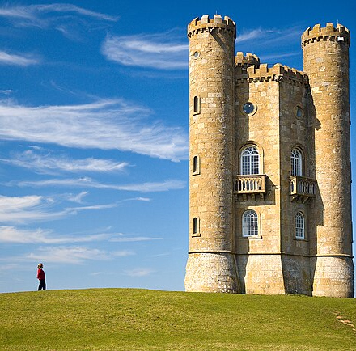

# CUDA-based Seam Carving

A high-performance implementation of content-aware image resizing using CUDA. This project implements the seam carving algorithm to intelligently resize images while preserving important content.

## Example

### Original Image


### Image after Seam Carving


## Features

- **CUDA Acceleration**: Leverages GPU parallelism for fast energy map computation and seam carving.
- **Seam Removal and Insertion**: Supports both removing and inserting seams for image resizing.
- **Multiple Resizing Modes**: 
  - Vertical and horizontal seam removal/insertion.
  - Target resizing to specific dimensions.
- **Seam Visualization**: Option to save and visualize seam paths on the image.
- **Experimentation Script**: Automated script to run predefined experiments and generate outputs.


## Prerequisites

- NVIDIA GPU with CUDA support
- CUDA Toolkit
- C++ compiler 
- Make build system

## Installation

1. Clone the repository:
```bash
git clone https://github.com/FILALIHicham/seam-carving-cuda.git
cd seam-carving-cuda
```

2. Build the project:
```bash
make
```

## Usage

### Basic Commands

```bash
./build/seam_carving -i <input_image> -o <output_image> [options]
```

### Options

- `-n <number>`: Number of seams to remove/insert
- `--horizontal`: Operate on horizontal seams instead of vertical
- `--insert`: Insert seams instead of removing them
- `--save-seams`: Save visualization of seam paths
- `--target <width>x<height>`: Resize to specific dimensions
- `--optimized`: Use optimized computation methods

### Examples

1. Remove 50 vertical seams:
```bash
./build/seam_carving -i data/tower.jpg -o output.png -n 50
```

2. Insert 30 horizontal seams:
```bash
./build/seam_carving -i data/tower.jpg -o output.png -n 30 --horizontal --insert
```

3. Resize to specific dimensions:
```bash
./build/seam_carving -i data/tower.jpg -o output.png --target 800x600
```

## Running Experiments

The project includes an automated experiment script (`exp.sh`) that runs various seam carving operations and saves the results:

1. Make the script executable:
```bash
chmod +x exp.sh
```

2. Run experiments:
```bash
./exp.sh
```

The script will:
- Clean and rebuild the project
- Create an `outputs` directory
- Run multiple seam carving operations with different parameters
- Save results and visualizations

### Experiment Output

Results will be saved in the `outputs` directory with the following naming convention:
- `output_remove_vertical_n{number}.png`: Vertical seam removal
- `output_remove_horizontal_n{number}.png`: Horizontal seam removal
- `output_insert_vertical_n{number}.png`: Vertical seam insertion
- `output_insert_horizontal_n{number}.png`: Horizontal seam insertion
- `output_target_resize_{number}.png`: Target size resizing

## Project Structure

```
└── seam-carving-cuda/
    ├── README.md
    ├── LICENSE
    ├── Makefile
    ├── exp.sh
    ├── data/           # Input images
    ├── include/        # External libraries
    ├── build/         # Compiled binaries
    └── src/           # Source code

```

## Implementation Details

The project uses several optimization techniques:
- Parallel computation of energy maps
- Efficient cumulative energy calculation
- GPU memory management
- Shared memory utilization for faster access

## Acknowledgments

- Seam Carving for Content-Aware Image Resizing (Avidan and Shamir)
- STB Image library for image I/O operations

